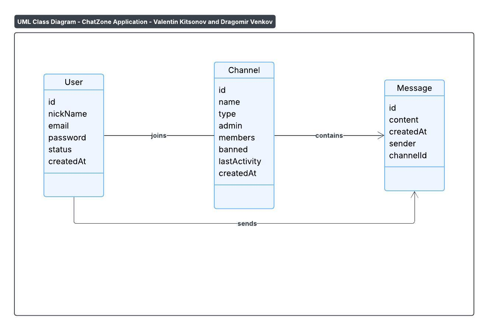

# ChatZone  

ChatZone is a **feature-rich real-time chat application** built with the Quasar Framework (Vue.js).  
It is created as part of the *Web Technologies* course at STU FIIT.

## 👥 Development Team

- **Valentin Kitsonov** - Frontend development, application architecture, state management
- **Dragomir Venkov** - UI/UX design, components, routing system

## 🚀 Features

### 🔐 User Management
- User status system (Online, Do Not Disturb, Offline)
- Real-time status updates visible to all users

### 💬 Channel System
- **Public & Private channels** with different permissions
- **Auto-cleanup system** - automatically deletes channels inactive for 30+ days
- **Channel name locking** - prevents reuse of deleted channel names for 7 days
- **New invite highlighting** - pinned channels with new invitations

### 📨 Messaging & Real-time Features
- **Real-time messaging** with typing indicators
- **Advanced mentions system** (`@username`) with yellow highlighting
- **Infinite scroll** for message history (General channel)
- **Command line interface** with slash commands

### ⚡ Advanced Functionality
- **Kick voting system** - 3 community votes result in permanent ban
- **Browser notifications** with app visibility detection
- **Notification preferences** - global or mentions-only mode
- **Admin privileges** - channel management and user moderation
- **Real-time typing preview** - see what others are typing before they send

### 🎯 Slash Commands
- `/join [name] [private]` - Create or join channels
- `/invite [user]` - Invite users to channels
- `/kick [user]` - Kick users (community voting in public channels)
- `/cancel` - Leave or delete channels
- `/list` - View channel members

## 🏗️ System Architecture

*Diagram created by Valentin Kitsonov and Dragomir Venkov*

## 🛠 Technologies Used

- **Framework**: Quasar (Vue.js 3)
- **State Management**: Pinia
- **Language**: JavaScript
- **Architecture**: Single Page Application (SPA)
- **UI**: Material Design components (Quasar UI)
- **Real-time Features**: Browser-based real-time simulation

## 📁 Project Structure
src/
├── pages/
│ ├── LoginPage.vue # User authentication
│ ├── RegisterPage.vue # User registration
│ ├── ChannelListPage.vue # Channels overview
│ └── ChatPage.vue # Main chat interface
├── stores/
│ └── channelsStore.js # Centralized state management
├── layouts/
│ └── MainLayout.vue # Application layout
└── router/
└── index.js # Vue Router configuration

## 🎓 Course Information

This project is developed for **Web Technologies** course at **STU FIIT**.  
It demonstrates advanced frontend development concepts including:
- Complex state management
- Real-time UI updates
- Advanced Vue.js composition API
- Responsive design principles
- Modern JavaScript patterns

## 🔮 Future Enhancements

- Backend integration with WebSocket support
- User authentication persistence
- File sharing capabilities
- Message reactions and threads

**Note**: This is a frontend prototype with simulated real-time functionality. All data is stored in-memory and resets on page refresh.

*Project developed by Valentin Kitsonov and Dragomir Venkov*
